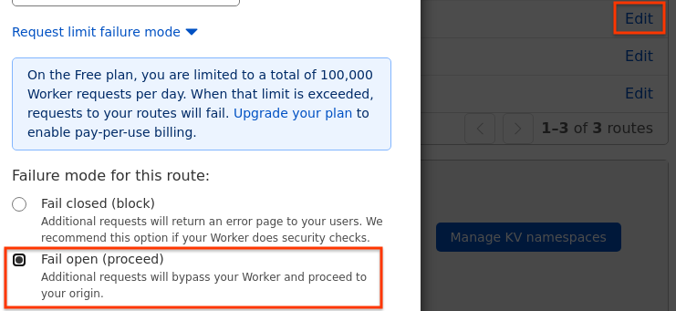

<!--
Copyright 2021 Google LLC

Licensed under the Apache License, Version 2.0 (the "License");
you may not use this file except in compliance with the License.
You may obtain a copy of the License at

    https://www.apache.org/licenses/LICENSE-2.0

Unless required by applicable law or agreed to in writing, software
distributed under the License is distributed on an "AS IS" BASIS,
WITHOUT WARRANTIES OR CONDITIONS OF ANY KIND, either express or implied.
See the License for the specific language governing permissions and
limitations under the License.
-->

# sxg-rs/cloudflare_worker

This is a [Cloudflare Worker](https://workers.cloudflare.com/) that
automatically generates [signed exchanges](https://web.dev/signed-exchanges/) (SXGs)
for your site. It enables the site to be [prefetched from Google
Search](https://developers.google.com/search/docs/advanced/experience/signed-exchange)
in order to improve its [Largest Contentful Paint](https://web.dev/lcp/),
one of the [Core Web Vitals](https://web.dev/vitals/).

## Ensure compatibility with SXG

The Google SXG Cache may reuse an SXG for several visits to the page, or for
several users (until SXG expiration). Before installing this worker with a
production certificate, follow [these
instructions](https://developers.google.com/search/docs/advanced/experience/signed-exchange#additional-requirements-for-google-search)
to ensure all signed pages are compatible with such reuse. To opt some pages
out of signing, set the `Cache-Control` header to include `private` or
`no-store` in the upstream server.

The Google SXG Cache tries to [update SXGs
often](https://developers.google.com/search/docs/advanced/experience/signed-exchange#:~:text=Regardless%20of%20the,the%20SXG%20response.),
but may reuse them for up to 7 days. To ensure they expire sooner, set
`s-maxage` or `max-age` on the `Cache-Control` header on the upstream server.

## Install

1. Get an SXG-compatible certificate
   using [these steps](../credentials/README.md#get-an-sxg_compatible-certificate).

1. Install [Rust](https://www.rust-lang.org/tools/install).
1. Install [@cloudflare/wrangler](https://github.com/cloudflare/wrangler).

1. Clone this repo and cd into the repository root folder.
   ```bash
   git clone https://github.com/google/sxg-rs.git
   cd sxg-rs/
   ```
   All following steps in this `README.md` should be done in the repository root folder.

1. Create your config input file from the template
   [input.example.yaml](../input.example.yaml).
   ```bash
   cp input.example.yaml input.yaml
   ```

1. Edit the `input.yaml` to put the information of your website.

   - To find Cloudflare **account ID** and **zone ID**,
     see [this screenshot](https://forum.aapanel.com/d/3914-how-to-get-zone-id-of-cloudflare).

1. Run following command.
   ```bash
      cargo run -p tools -- gen-config --input input.yaml --artifact artifact.yaml
   ```
   This command will creates a `cloudflare_worker/wrangler.toml` that can be modified futher if desired.

   - For example, you can customize the `routes` list in `wrangler.toml` based on the
     [Cloduflare Docs](https://developers.cloudflare.com/workers/platform/routes/#matching-behavior).
     But you need to leave the patterns starting with `/.well-known/` enabled, in order to keep
     SXG working.

1. Put your private key as a
   [secret](https://developers.cloudflare.com/workers/cli-wrangler/commands#secret)
   to cloudflare worker.
   1. Parse your private key to JWK format.
      ```bash
      go run credentials/parse_private_key.go <credentials/privkey.pem
      ```
   1. Run `cd cloudflare_worker && wrangler secret put PRIVATE_KEY_JWK`. (Use the string
      `PRIVATE_KEY_JWK` as is, and don't replace it with the
      actual private key.)
   1. The terminal will interactively ask for the value of the secret.
      Put the private key in JWK format here.

1. Run `./publish.sh` to build and deploy the worker online.

1. Go to the [workers dashboard](https://dash.cloudflare.com/workers), and edit
   the `your_domain.com/*` route to fail open, like this:
   

1. To check whether the worker generates a valid SXG,
   use Chrome browser to open `https://${WORKER_HOST}/.sxg/test.html`.

1. Read on for [next steps](../README.md#next-steps).

## Maintain

The certificates need to be renewed every 90 days.

1. Follow [these steps](../credentials/README.md#renew-certificate) to renew
   the certificate.
1. Run `cargo run -p tools -- gen-config`.
1. Run `./publish.sh` to restart the worker.

## Uninstall

The worker and KV namespace can be deleted from the [workers
dashboard](https://dash.cloudflare.com/workers/overview).
