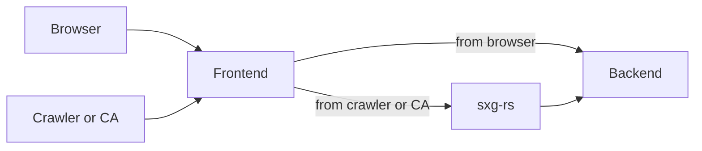
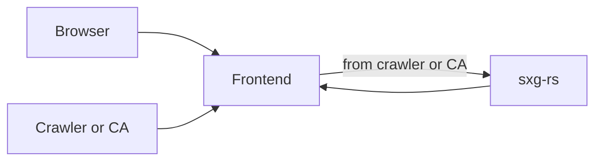

# sxg-rs HTTP server

An HTTP reverse-proxy server enabling SXG support, similar to [Web Packager
Server](https://github.com/google/webpackager/blob/main/cmd/webpkgserver/README.md),
but based on the more featureful [sxg-rs library](../sxg_rs).

## Configure the frontend server

This server is meant to sit behind a frontend server like Envoy, haproxy,
nginx, or Apache, and receive only eligible traffic. The frontend server should
forward the following requests to `http_server`:

 - Requests for SXGs from crawlers (per [this
   recommendation](https://github.com/google/webpackager/tree/main/cmd/webpkgserver#content-negotiation))
 - Requests for SXG certs (path prefix of `/.well-known/sxg-certs/`)
 - Requests from ACME providers (path prefix of `/.well-known/acme-challenge/`)



By default, `http_server` serves requests from localhost on port 8080, but this
can be configured with `--bind_addr`.

If configuring caching for the responses from this server, ensure that the
cache key includes a boolean of whether the request is from an SXG crawler.
Serving SXGs to browsers can conflict with some web features such as service
workers.

## Installation

1. Copy `input.example.yaml` to `input.yaml`. Edit the `sxg_worker.html_host`
   field to reflect the public domain name being served.

1. Get an SXG-compatible certificate
   using [these steps](../credentials/README.md#get-an-sxg_compatible-certificate).

   * If you are using
   [ACME](../credentials/README.md#option-1-automatic-certificate-management-environment-acme),
   you should have followed the instructions to comment the entire `pre_issued`
   [section](../input.example.yaml#L29-L31),
   and uncomment `create_acme_account`
   [section](../input.example.yaml#L32-L43)
   in `input.yaml`.

1. Run following command.
   ```bash
   cargo run -p tools -- gen-config --platform http-server
   ```
   This command will read `input.yaml` and create `artifact.yaml` and
   `http_server/config.yaml`. If re-running `gen-config`, it will maintain some
   values in the existing `artifact.yaml`.

1. Build the server:
   ```bash
   cargo build -p http_server -r
   ```
   (Or use [`cross`](https://github.com/cross-rs/cross) to cross-compile for
   the production architecture.)

1. Run the server. The `--backend` flag is required; it specifies the location
   of the HTTP server whose HTML/images/etc. will be fetched and signed.
   ```
   target/release/http_server --backend http://some-backend
   ```

## Persist configuration

When running in production, the server needs read access to `artifact.yaml`
(`--artifact`) and `http_server/config.yaml` (`--config`).

The following files do not contain sensitive key material, and are safe to
store in version control: `input.yaml`, `credentials/cert.pem`,
`credentials/issuer.pem`

The following files should be stored somewhere private (only accessible to prod
servers and relevant ops teams): `artifact.yaml`, `http_server/config.yaml`,
`credentials/privkey.pem`

If using the Google CA and you lose `artifact.yaml`, you must request a new key
ID and HMAC; each EAB is valid for one use only.

## (Optional) Configure storage

By default, `http_server` caches ACME and OCSP information in `/tmp/sxg-rs`;
this can be configured with `--directory`. If setting up multiple replicas of
`http_server`, consider pointing this to a shared file system in order to meet
the best practices [for
OCSP](https://gist.github.com/sleevi/5efe9ef98961ecfb4da8) and [for
ACME](https://github.com/https-dev/docs/blob/master/acme-ops.md).

## (Optional) Reusing the frontend server as the backend

It is possible to configure the frontend server to act also as the backend
server, but care should be taken to avoid infinite network loops.




Here's an example in nginx that appears to work. It proxies to `http_server`
only when the request is HTTPS and either an SXG crawler or an ACME provider.
When running `http_server --backend http://localhost`, the inner request is not
HTTPS, so the loop is broken.

```
server {
  location / {
    set $PROXY "";
    if ($https) {
      set $PROXY "1";
    }
    set $PROXY_ELIGIBLE "";
    if ($http_accept ~* "(^|,)\s*application/signed-exchange\s*;\s*v=[[:alnum:]_-]+\s*(,|$)") {
      set $PROXY_ELIGIBLE "1";
    }
    if ($request_uri ~ "/.well-known/acme-challenge/") {
      set $PROXY_ELIGIBLE "1";
    }
    if ($request_uri ~ "/.well-known/sxg-certs/") {
      set $PROXY_ELIGIBLE "1";
    }
    if ($PROXY_ELIGIBLE) {
      set $PROXY "${PROXY}1";
    }
    if ($PROXY = "11") {
      proxy_pass http://127.0.0.1:8080;
    }

    # This helps break infinite loops in case of a bug in the above; eventually
    # hyper will fail to parse the request with a TooLarge error.
    add_header Vary Accept always;
  }
}
```

Care must also be exercised when using `if` in nginx; see [this
article](https://www.nginx.com/resources/wiki/start/topics/depth/ifisevil/).

## Maintenance

If not using ACME, you must reacquire a certificate before it expires (at least
every 90 days) and restart the servers to read the new cert.pem.

On a regular schedule, you could also generate a new private key, reacquiring
certificates and restarting servers to pick up the changes. Best practices for
key rotation are not in scope for this document.
